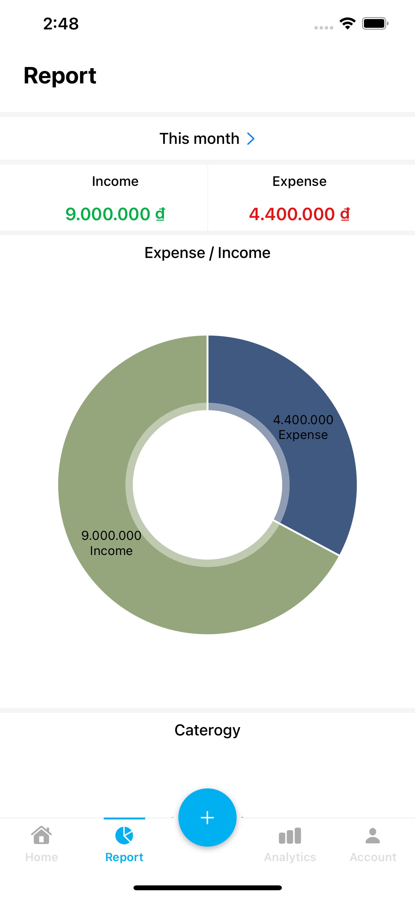

#  Ứng dụng quản lý chi tiêu
***

Thay thế cuốn sổ tay ghi chép lại mọi hoạt động thu chi hàng ngày, hàng tháng, hàng năm.
Thống kê chi tiết giúp người dùng biết được nguồn tiền ra vào, tối ưu hoá mục đích sử dụng nguồn tiền và quản lý chi tiêu hợp lý.

## Ảnh chụp màn hình

   
   

<!---->
<!---->
<!---->
<!---->
<!---->
<!---->
<!---->

## Chức năng chính
- Tạo và đăng nhập tài khoản
- Thêm, sửa, xoá thu chi giao dịch
- Thống kê phân tích bằng biểu đồ theo tháng và năm

## Thư viện sử dụng
    pod 'FirebaseAuth'
    pod 'FirebaseFirestore'
    pod 'FBSDKLoginKit'
    pod 'GoogleSignIn'
    pod "MonthYearPicker", '~> 4.0.2'
    pod 'Charts'
    pod 'SwiftyJSON', '~> 4.0'
    pod 'RealmSwift', '~>10'
    
## Tác giả
- [Tu Nguyen](https://www.facebook.com/tuna194/)
